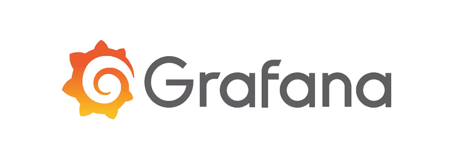
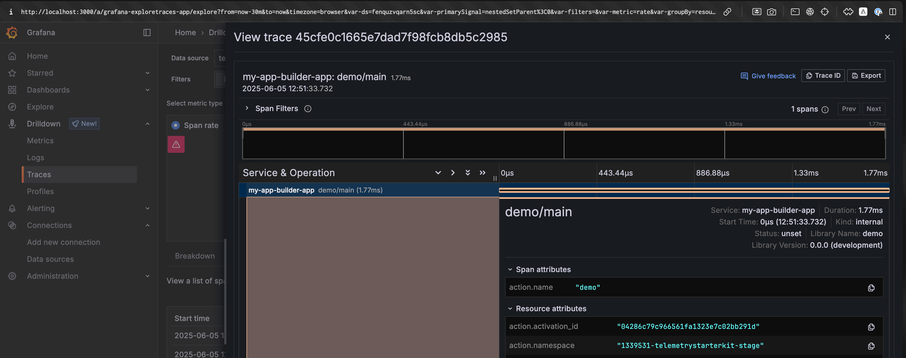
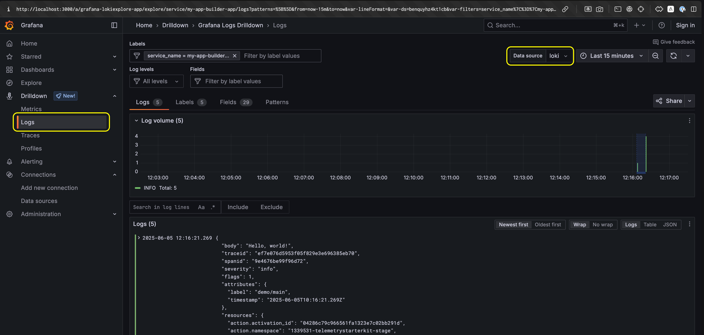

# OpenTelemetry Instrumentation with Grafana

<br />
<div align="center">
  
</div>
<br />

This guide demonstrates how to quickly set up Grafana with App Builder runtime actions using the Docker LGTM stack, an all-in-one OpenTelemetry backend perfect for development and testing.

> [!NOTE]
> **Looking for more control?** This guide uses the streamlined Docker LGTM approach for quick setup. If you need a fully customizable configuration with individual component control (custom OpenTelemetry Collector configs, specific retention policies, advanced exporters, etc.), see our [Advanced Grafana Setup Guide](./grafana/advanced.md). Note that the advanced approach is more complex and requires managing multiple configuration files.

- [OpenTelemetry Instrumentation with Grafana](#opentelemetry-instrumentation-with-grafana)
  - [What is Docker LGTM?](#what-is-docker-lgtm)
  - [Prerequisites](#prerequisites)
  - [Quick Start](#quick-start)
  - [Configure Your App Builder Action](#configure-your-app-builder-action)
  - [Visualize the Data](#visualize-the-data)
  - [Deployed Actions (via Tunneling)](#deployed-actions-via-tunneling)
  - [Next Steps](#next-steps)

## What is Docker LGTM?

The [`grafana/otel-lgtm`](https://github.com/grafana/docker-otel-lgtm/) Docker image is an open source OpenTelemetry backend intended for development, demo, and testing environments. It includes:

- **OpenTelemetry Collector** (pre-configured to receive telemetry data)
- **Prometheus** (for metrics storage)
- **Tempo** (for distributed tracing)
- **Loki** (for log aggregation)
- **Grafana** (for visualization)
- **Pyroscope** (for continuous profiling)

All components are pre-configured and work together out of the box, making this the **easiest way to get started** with OpenTelemetry observability for your App Builder apps.

> [!IMPORTANT]
> The `grafana/otel-lgtm` image is designed for **development, demo, and testing environments only**. For production-ready observability, consider [Grafana Cloud Application Observability](https://grafana.com/products/cloud/application-observability/) or see our [Advanced Grafana Setup Guide](./grafana/advanced.md) for self-hosted production deployments.

## Prerequisites

- Docker installed and running
- An App Builder project with OpenTelemetry instrumentation

## Quick Start

Start the LGTM stack with a single command:

```bash
docker run --rm -p 3000:3000 -p 4317:4317 -p 4318:4318 \
  --name otel-lgtm \
  grafana/otel-lgtm:latest
```

This exposes:

- **Port 3000**: Grafana UI
- **Port 4317**: OTLP gRPC endpoint
- **Port 4318**: OTLP HTTP endpoint (recommended)

> [!TIP]
> To persist data across container restarts, mount a volume:
>
> ```bash
> docker run --rm -p 3000:3000 -p 4317:4317 -p 4318:4318 \
>   -v lgtm-data:/data \
>   --name otel-lgtm \
>   grafana/otel-lgtm:latest
> ```

## Configure Your App Builder Action

Configure your App Builder actions to send telemetry to the LGTM collector:

```ts
// telemetry.{ts,js}
import {
  defineTelemetryConfig,
  getAioRuntimeResource,
  getPresetInstrumentations,
} from "@adobe/aio-lib-telemetry";

import {
  OTLPTraceExporterProto,
  OTLPLogExporterProto,
  OTLPMetricExporterProto,
  PeriodicExportingMetricReader,
  SimpleLogRecordProcessor,
} from "@adobe/aio-lib-telemetry/otel";

export const telemetryConfig = defineTelemetryConfig((params, isDev) => {
  return {
    sdkConfig: {
      serviceName: "my-app-builder-app",
      instrumentations: getPresetInstrumentations("simple"),
      resource: getAioRuntimeResource(),

      // Configure exporters to send to local LGTM collector
      // Not specifying a URL will default to http://localhost:4318
      // This is fine as the Docker Image has an OpenTelemetry Collector running on port 4318
      traceExporter: new OTLPTraceExporterProto(),
      metricReader: new PeriodicExportingMetricReader({
        exporter: new OTLPMetricExporterProto(),
      }),
      logRecordProcessors: [
        new SimpleLogRecordProcessor(new OTLPLogExporterProto()),
      ],
    },
  };
});
```

> [!NOTE]
> When you don't specify a URL in the exporter configuration, OpenTelemetry uses the default endpoint `http://localhost:4318`, which matches the LGTM collector perfectly.

That's it! Start your App Builder action locally with `aio app dev` and it will send telemetry to the LGTM stack.

## Visualize the Data

Access Grafana at `http://localhost:3000` (no login required, the LGTM image has authentication disabled by default).

The LGTM stack comes pre-configured with data sources for Tempo, Loki, and Prometheus, so you can immediately explore your telemetry data:

### Traces

Go to **Drilldown** and click on the **Traces** tab in the left sidebar. Ensure **Tempo** is selected as your data source. You'll find your traces listed in the **Traces** tab.


Click on any trace to see its details, including spans and attributes. You can copy the trace ID and use it to correlate logs and metrics.



### Metrics

Navigate to **Drilldown** and select the **Metrics** tab. With **Prometheus** as your data source, you'll see pre-configured visualizations of your metrics.


### Logs

Go to **Drilldown** and select the **Logs** tab. Set **Loki** as your data source and click "**Show Logs**" for the full-featured log viewer.



## Deployed Actions (via Tunneling)

For deployed App Builder actions (using `aio app deploy`), you can forward telemetry from the cloud back to your local LGTM stack using tunneling. This is useful for development and testing scenarios.

> [!CAUTION]
> **Development/Testing Only**: Tunneling is a hybrid "dev-in-prod" approach ideal for testing deployed actions while keeping observability tools local for easier debugging.
>
> **For production deployments**, host your observability stack on cloud infrastructure (AWS, Azure, GCP) or use [Grafana Cloud](https://grafana.com/products/cloud/) and configure direct data transmission (no tunneling required).

### Prerequisites

- A running LGTM Docker container (from the [Quick Start](#quick-start) section)
- A tunneling tool installed (see [Tunneling Guide](./support/tunnel-forwarding.md) for options and setup)

### Setup Tunneling

**Step 1**: Ensure your LGTM container is running:

```bash
docker run --rm -p 3000:3000 -p 4317:4317 -p 4318:4318 \
  --name otel-lgtm \
  grafana/otel-lgtm:latest
```

**Step 2**: Start a tunnel pointing to the OTLP HTTP endpoint (port 4318):

```bash
# Example with Cloudflare Tunnel (Linux)
docker run --rm -it --net=host \
  cloudflare/cloudflared:latest tunnel --url http://localhost:4318

# Example with Cloudflare Tunnel (MacOS/Windows)
docker run --rm -it \
  cloudflare/cloudflared:latest tunnel --url http://host.docker.internal:4318
```

> [!TIP]
> If you run the tunnel in detached mode (`-d` instead of `-it`), you'll need to find the tunnel URL by checking the container logs:
>
> ```bash
> docker logs <container-name>
> ```
>
> Or view the logs in Docker Desktop's container details.

**Step 3**: Note the tunnel URL from the output (e.g., `https://abc123-def456.trycloudflare.com`)

> [!TIP]
> For a comprehensive comparison of tunneling tools (Cloudflare, ngrok, localtunnel, etc.) and detailed setup instructions, see our [Tunneling Guide](./support/tunnel-forwarding.md).

### Configure Your Deployed Action

Update your telemetry configuration to use the tunnel URL:

```ts
// telemetry.{ts,js}
import {
  defineTelemetryConfig,
  getAioRuntimeResource,
  getPresetInstrumentations,
} from "@adobe/aio-lib-telemetry";

import {
  OTLPTraceExporterProto,
  OTLPLogExporterProto,
  OTLPMetricExporterProto,
  PeriodicExportingMetricReader,
  SimpleLogRecordProcessor,
} from "@adobe/aio-lib-telemetry/otel";

function makeCollectorConfig(exportUrl) {
  const makeExporterConfig = (path) => ({
    url: `${exportUrl}/${path}`,
  });

  return {
    traceExporter: new OTLPTraceExporterProto(makeExporterConfig("v1/traces")),
    metricReader: new PeriodicExportingMetricReader({
      exporter: new OTLPMetricExporterProto(makeExporterConfig("v1/metrics")),
    }),
    logRecordProcessors: [
      new SimpleLogRecordProcessor(
        new OTLPLogExporterProto(makeExporterConfig("v1/logs")),
      ),
    ],
  };
}

export const telemetryConfig = defineTelemetryConfig((params, isDev) => {
  // Use tunnel URL for deployed actions, localhost for local dev
  const exportUrl = isDev
    ? "http://localhost:4318"
    : "https://abc123-def456.trycloudflare.com"; // Replace with your tunnel URL

  return {
    sdkConfig: {
      serviceName: "my-app-builder-app",
      instrumentations: getPresetInstrumentations("simple"),
      resource: getAioRuntimeResource(),

      ...makeCollectorConfig(exportUrl),
    },
  };
});
```

**Step 4**: Deploy your action and test it:

```bash
aio app deploy
```

Your deployed action will now send telemetry through the tunnel to your local LGTM stack, where you can view it in Grafana at `http://localhost:3000`.

## Next Steps

- **Custom Configuration**: Need more control over individual components? Check out the [Advanced Grafana Setup Guide](./grafana/advanced.md) for custom Docker Compose stacks with full configurability
- **Production Deployment**: For production, consider [Grafana Cloud](https://grafana.com/products/cloud/) or deploying the LGTM stack to your cloud provider
- **Integrations**: Explore pre-built [integrations](./integrations/README.md) for common use cases
